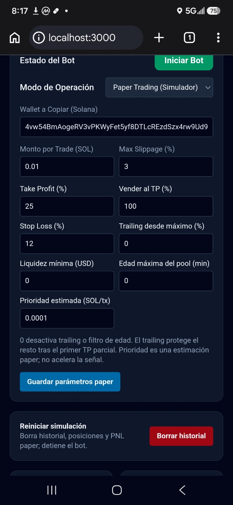
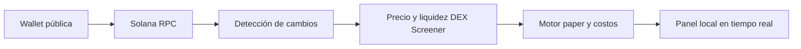

# ⚡ Solana CopyBot · Termux

### Seguimiento de wallets y simulación de copytrading de memecoins en Android

   

**Solana CopyBot** observa las transacciones confirmadas de una wallet pública de Solana y simula compras y ventas desde un panel web local. El historial, los costos y el PNL ayudan a estudiar una estrategia de seguimiento antes de arriesgar capital.

> **Estado actual:** solo paper trading. El modo live permite preparar y verificar la propiedad de una wallet mediante una firma de mensaje; **no envía swaps ni mueve fondos**. Los resultados simulados no representan precios de ejecución garantizados.

## 📱 Vista previa

<p align="center"></p>

> Captura del panel en Android. Los valores mostrados son de una sesión de prueba y no indican rentabilidad futura.

## ✨ Funciones

| Módulo | Disponible hoy |
| --- | --- |
| Seguimiento | Escucha eventos confirmados de una wallet pública mediante Solana RPC y WebSocket. |
| Validación de precio | Consulta DEX Screener y requiere precio y liquidez antes de abrir una posición paper. |
| Simulación | Estima tarifa de red, prioridad configurada, comisión DEX e impacto de la orden sobre liquidez, tanto al entrar como al salir. |
| Gestión | Tamaño por operación, slippage máximo, take profit total o parcial, stop loss y trailing del remanente tras un TP parcial. |
| Filtros | Liquidez mínima y antigüedad máxima del pool cotizado. |
| Panel | Métricas en SOL y USD cuando hay cotización, curva de PNL realizado, posiciones, operaciones, eventos copiables y enlaces a gráfico y Solscan. |
| Control | Inicio y pausa, parámetros configurables y reinicio confirmado del historial paper. |

## 🧭 Cómo funciona



El bot no reconstruye operaciones anteriores al inicio del seguimiento. Si no encuentra una cotización y liquidez verificables, registra el motivo y omite la compra.

## 🚀 Instalación en Termux

Requiere **Node.js 20 o superior**, `git` y acceso a un RPC de Solana con endpoints HTTP y WebSocket. En Termux:

```bash
pkg install nodejs git -y
git clone https://github.com/hugginarts/solana-copybot-termux.git
cd solana-copybot-termux
npm ci
```

Configura tus endpoints RPC en un archivo `.env` local:

```dotenv
RPC_HTTP=https://TU_ENDPOINT_RPC_HTTP
RPC_WS=wss://TU_ENDPOINT_RPC_WS
PORT=3000
```

Luego inicia el servidor:

```bash
npm start
```

Abre **http://localhost:3000** en el navegador del mismo teléfono, introduce la wallet pública que deseas observar y pulsa **Iniciar Bot**. También puedes usar la carpeta `~/bot-solana` que ya tienes instalada; el nombre del repositorio no cambia la ruta de esa instalación.

> Guarda `.env` solo en el teléfono o servidor. Nunca publiques claves API, frases de recuperación ni claves privadas. El proyecto ignora `.env`, `data/` y `node_modules/` al subir cambios con Git.

## ⚙️ Parámetros del panel

| Parámetro | Efecto en paper trading |
| --- | --- |
| Monto por trade | SOL de entrada simulada por señal admitida. |
| Slippage máximo | Omite órdenes cuyo impacto estimado excede el límite. |
| Take profit / Vender al TP | Umbral de PNL neto y porcentaje de la posición a vender. |
| Stop loss | Umbral de pérdida neta para intentar el cierre. |
| Trailing desde máximo | Protege el remanente después de un TP parcial. `0` lo desactiva. |
| Liquidez mínima | Rechaza pools cotizados por debajo del valor indicado en USD. |
| Edad máxima del pool | Rechaza pools DEX más antiguos que el límite en minutos. `0` lo desactiva. |
| Prioridad estimada | Agrega un costo de red estimado por operación; **no acelera la detección**. |

**PNL realizado** suma las ventas paper cerradas, con costos estimados. Las posiciones abiertas se muestran por separado. Una venta parcial se contabiliza como cierre parcial; el win rate cuenta ventas cerradas, no necesariamente tokens distintos.

## 🔎 Límites conocidos

- Los precios y la liquidez publicados por DEX Screener son indicativos; el deslizamiento real puede ser mayor. La aproximación de impacto no sustituye una cotización ejecutable.
- Tokens en bonding curve antes de tener un pool cotizable, rutas con wSOL/USDC sin cambio directo de SOL y transacciones complejas pueden no detectarse.
- TP, SL y trailing se revisan cuando llega una actualización de precio. Un cierre puede ejecutarse en la simulación lejos del umbral configurado o permanecer pendiente si falta precio o se supera el slippage.
- No hay análisis de honeypot/rugpull ni protección Jito implementados. La firma de Phantom solo prueba control de la wallet y no habilita operaciones reales.
- Para una instalación nueva necesitas tu propio endpoint RPC. Si aparece `429`, el proveedor limitó las consultas y el seguimiento se pausa.

## 🛠️ Desarrollo

```bash
npm run check
```

| Ruta | Responsabilidad |
| --- | --- |
| `server.js` | API local, estado, WebSocket y entrega del panel. |
| `src/watcher.js` | Suscripción RPC y análisis de transacciones confirmadas. |
| `src/market.js` | Consulta de precio y liquidez DEX. |
| `src/engine.js` | Simulación, costos, posiciones y métricas. |
| `public/index.html` | Interfaz móvil del dashboard. |

---

Hecho para investigar estrategias de copytrading en Solana desde un teléfono, con transparencia sobre lo que el simulador puede y no puede medir.
